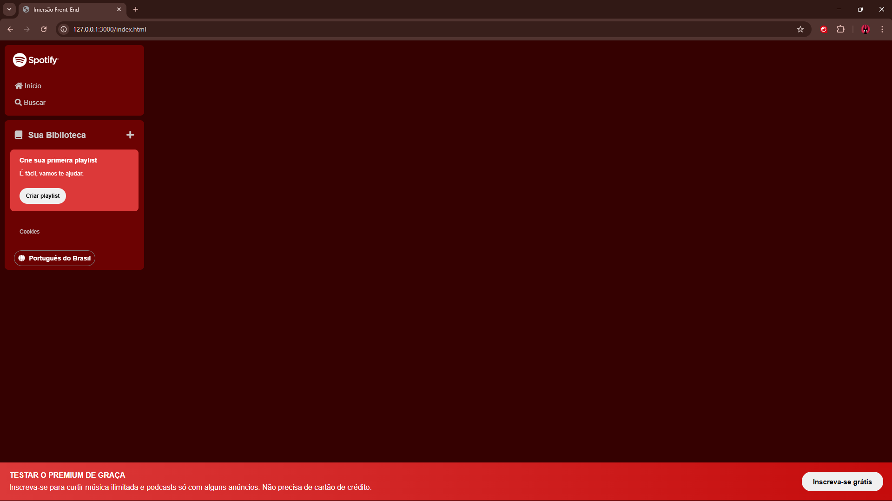

# 📞 Imersão Front-End

## 📰 Descrição

Projeto da segunda edição da **"Imersão Front-End"** da Alura, desenvolvido durante a última semana de janeiro de 2025 (27/01 até 31/01)

Esse projeto replica a **tela inicial do Spotify**, mas com espaço para alterações pessoais e individuais 

> Os desafios propostos nas duas primeiras aulas já foram realizados (*individualmente*), sendo eles: **"cabeçalho" da aba Sua Biblioteca e "footer" do site** 
> - Alguns detalhes foram mudados/adicionados *opcionalmente*, sendo eles: **site agora completamente vermelho e mudança no estilo dos "botões" ao passar mouse por cima**

## 🔗 Link para vizualização

## 💻 Tecnologias Utilizadas
`Trabalhado durante o curso (até o momento):`

 

## 🙋 Autores
[    Gabriel Possato ](https://github.com/possatogabriel)
 
 

    
